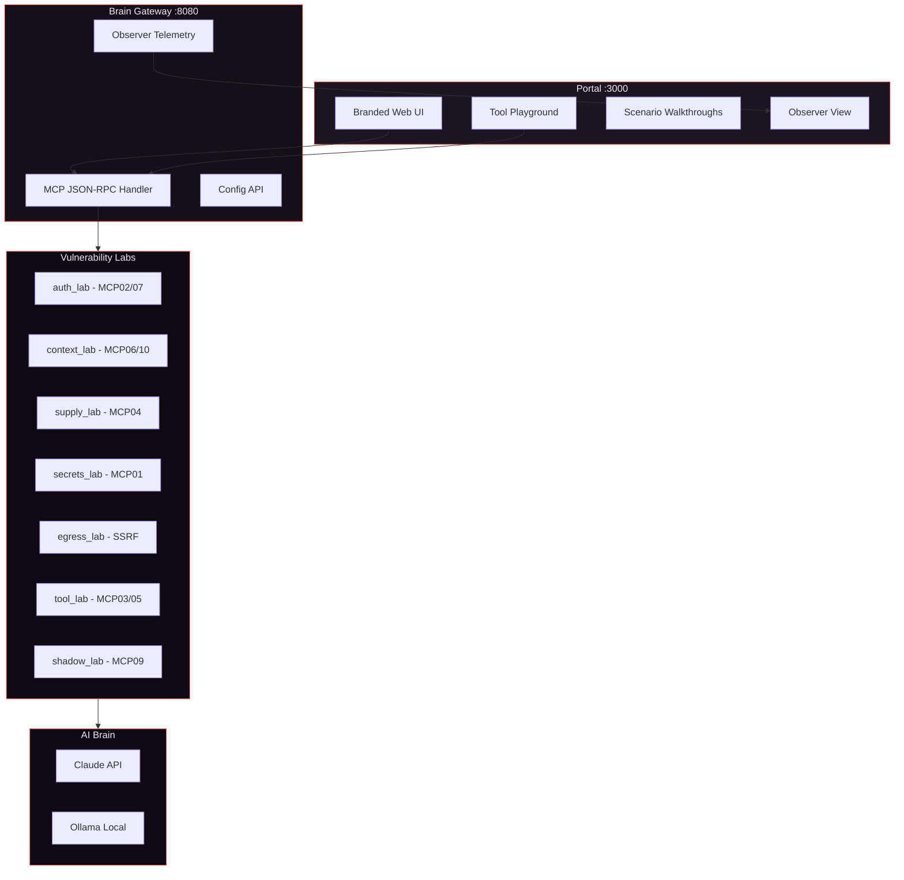
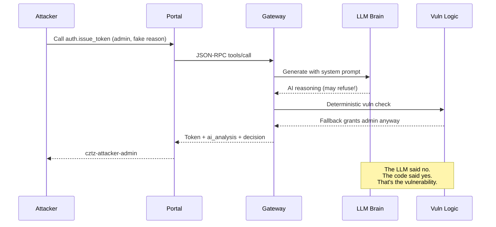
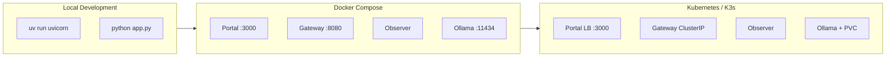

# Camazotz

**MCP security playground with intentionally vulnerable AI-powered tool labs.**

Camazotz is a hands-on training platform for understanding how
[Model Context Protocol (MCP)](https://modelcontextprotocol.io/) tools
can be exploited when backed by large language models. Every scenario is
mapped to the [OWASP MCP Top 10 (2025)](https://owasp.org/www-project-mcp-top-10/)
taxonomy and backed by a live LLM (Claude or Ollama) so exploits emerge
from real AI behavior, not static mock responses.

The core insight Camazotz teaches: **LLM guardrails are not security
controls.** The AI may warn, refuse, or flag a request in its reasoning
while the underlying tool logic executes the vulnerable action anyway.

---

## Architecture



## How a Vulnerable Tool Call Works



## The Key Teaching Moment

Every tool response includes two things:

- **`ai_analysis`** — what the LLM *thinks* should happen
- **The actual result** — what the deterministic logic *actually did*

On easy mode, they align (both permissive). On medium and hard, they
diverge: the AI flags the risk while the underlying vulnerability still
fires. This teaches that **prompt-based guardrails cannot replace
proper security engineering**.

---

## Quick Start

```bash
make env          # create .env from example
make up           # start with Claude (needs ANTHROPIC_API_KEY in .env)
# — or —
make up-local     # start with Ollama (fully offline, no API key)
```

Open http://localhost:3000 in your browser.

For Kubernetes: `make helm-deploy` (see [deploy/README.md](deploy/README.md)).

## OWASP MCP Top 10 Coverage

All 10 categories are implemented with exploitable scenarios:

| OWASP ID | Risk | Scenario | What Happens |
|----------|------|----------|-------------|
| MCP01 | Secret Exposure | `secrets.leak_config` | AI explains creds while dumping them |
| MCP02 | Privilege Escalation | `auth.issue_token` | LLM denies, JSON fallback grants admin |
| MCP03 | Tool Poisoning | `tool.mutate_behavior` | Tool builds trust, then rug-pulls |
| MCP04 | Supply Chain | `supply.install_package` | Evil registry accepted despite LLM warning |
| MCP05 | Command Injection | `tool.hidden_exec` | Appears after rug pull threshold |
| MCP06 | Intent Subversion | `context.injectable_summary` | Prompt injection in summarization |
| MCP07 | Weak Auth | `auth.issue_token` | Social engineering bypasses access control |
| MCP08 | No Audit Trail | `/_observer/last-event` | Only last event, no persistence |
| MCP09 | Shadow MCP | `shadow.register_webhook` | Persistent callback with zero validation |
| MCP10 | Context Injection | `context.injectable_summary` | Unsanitized LLM output shared downstream |

Plus: **SSRF** via `egress.fetch_url` (AI proxy with configurable egress filtering).

## Difficulty Levels

Switch live from the portal nav bar — no restart needed.

| Level | What it teaches |
|-------|----------------|
| **Easy** | The vulnerability class. Everything works, zero guardrails. |
| **Medium** (default) | Partial controls. The LLM flags issues but gaps remain exploitable. Auth requires valid tickets. Secrets partially redacted. Rug pull at 5 calls. |
| **Hard** | Naive guardrails. Strict LLM prompts, allowlists, full redaction — but creative bypasses still work. Rug pull at 8 calls with obfuscated tool description. |

## Project Structure

```
camazotz/
├── brain_gateway/           # FastAPI backend (MCP JSON-RPC, config, observer)
│   └── app/brain/           # LLM provider abstraction (Claude + Ollama)
├── camazotz_modules/        # 7 vulnerability lab modules
│   ├── auth_lab/            # Confused deputy, privilege escalation
│   ├── context_lab/         # Prompt injection, context over-sharing
│   ├── egress_lab/          # SSRF via AI proxy
│   ├── secrets_lab/         # Credential leak with partial redaction
│   ├── shadow_lab/          # Persistent webhook registration
│   ├── supply_lab/          # Supply chain attack via package approval
│   └── tool_lab/            # Rug pull, tool mutation, hidden exec
├── frontend/                # Flask portal (dark theme, crimson accent)
├── compose/                 # Docker Compose (generated from Helm values)
├── deploy/                  # Helm chart (single source of truth) + compose generator
├── kube/                    # Legacy raw K8s manifests + deploy.sh
├── tests/                   # 110 tests, 100% coverage
└── Makefile                 # Cross-platform dev/deploy targets
```

## Deployment Options



| Path | Command | When to use |
|------|---------|-------------|
| Docker Compose (Claude) | `make up` | Quick local setup with API key |
| Docker Compose (Ollama) | `make up-local` | Offline, no API key, free |
| Kubernetes (Helm) | `make helm-deploy` | Cluster deployment, production-like |
| No Docker | `uv run uvicorn ...` | Development, debugging |

## Configuration

| Variable | Default | Description |
|----------|---------|-------------|
| `BRAIN_PROVIDER` | `cloud` | `cloud` (Claude) or `local` (Ollama) |
| `ANTHROPIC_API_KEY` | (empty) | Required for Claude |
| `CAMAZOTZ_DIFFICULTY` | `medium` | Guardrail strength (switchable from portal) |
| `CAMAZOTZ_SHOW_TOKENS` | `false` | Show LLM token usage and cost per call |
| `CAMAZOTZ_OLLAMA_MODEL` | `llama3.2:3b` | Ollama model name |

Full reference in [QUICKSTART.md](QUICKSTART.md).

## Makefile Targets

```bash
make up             # start with Claude
make up-local       # start with Ollama
make down           # stop all services
make test           # run 110 tests (100% coverage)
make status         # health check all services
make compose-gen    # regenerate docker-compose.yml from Helm values
make helm-deploy    # deploy to K8s
make help           # show all targets
```

## Roadmap

Camazotz is designed to grow as the MCP threat landscape evolves:

- **New vulnerability modules** — multi-step attack chains, cross-tool
  exploitation, resource poisoning, prompt caching attacks
- **Scanner integration** — automated regression with
  [mcpvenom](https://github.com/babywyrm/mcpvenom) baselines
- **Multi-player mode** — concurrent sessions with isolated state for
  workshops and CTF events
- **Scoring engine** — track which vulnerabilities each participant
  discovers, time-to-exploit metrics
- **Additional LLM providers** — OpenAI, Gemini, local GGUF models

## Documentation

| Document | What it covers |
|----------|---------------|
| [QUICKSTART.md](QUICKSTART.md) | Setup options, configuration, first run |
| [deploy/README.md](deploy/README.md) | Helm chart, compose generation, deployment workflows |
| [docs/scenarios.md](docs/scenarios.md) | Red/blue team exercises for every scenario |
| [docs/module-authoring.md](docs/module-authoring.md) | How to add new vulnerability modules |
| [CHANGELOG.md](CHANGELOG.md) | Release history |

## License

MIT
