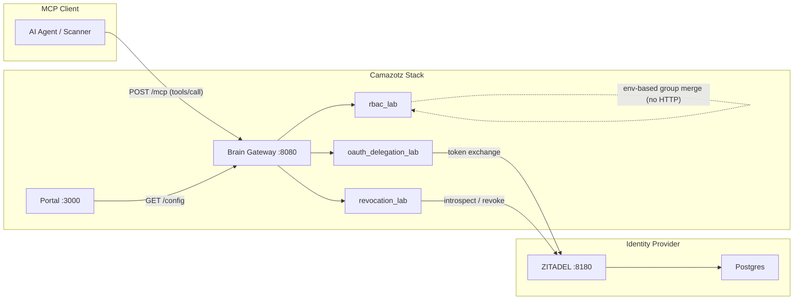
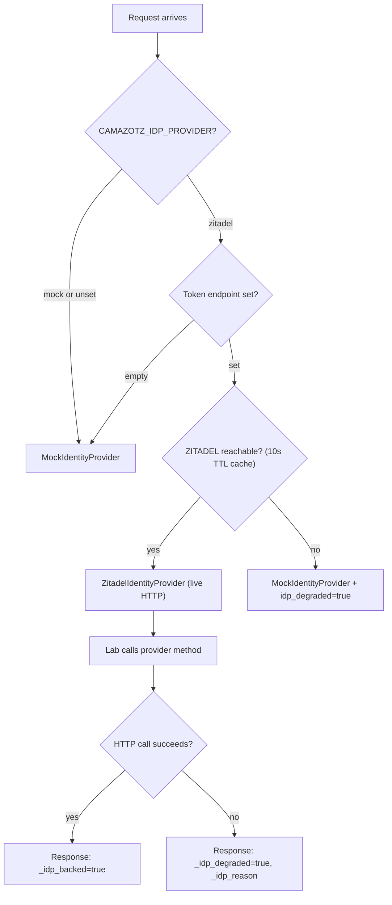
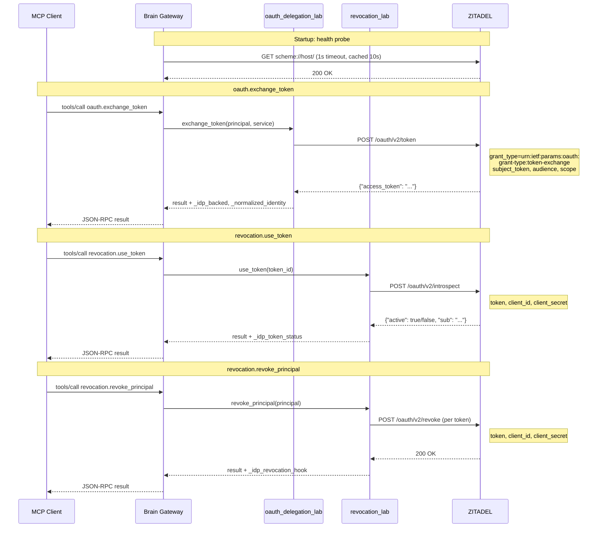

# Camazotz Identity Guide

The single reference for understanding, configuring, and testing identity flows in Camazotz. Written for both **security learners** exploring MCP attack surfaces and **operators** deploying the platform.

---

## Part 1: Why Identity Matters in MCP Security

### The core problem

MCP tools execute actions on behalf of users. Without a verifiable identity chain, there is no way to:

- Distinguish a legitimate delegation from a confused deputy attack
- Prove that a token was issued to a specific principal
- Revoke access when an employee is offboarded
- Enforce group-based boundaries on which agents a user can trigger

Every MCP security challenge in Camazotz exists because these identity properties can be absent, weak, or bypassable. The IDP integration makes this concrete by wiring real OAuth token lifecycle operations into the challenge labs.

### What "IDP-backed" means in Camazotz

Camazotz runs in two identity modes:

| Mode | Behavior |
|------|----------|
| `mock` | All token operations use deterministic synthetic values. Safe for CI, fast iteration, and challenges where identity is not the focus. |
| `zitadel` | Three challenge labs ("the IDP trio") use live HTTP calls to a self-hosted ZITADEL instance for token exchange, introspection, and revocation. Other labs remain unchanged. |

When you see `_idp_backed: true` in a tool response, that operation went through (or attempted) the real provider path.

### The IDP-backed trio

These three labs demonstrate identity vulnerabilities that only become realistic with a live identity provider:

**OAuth Token Theft & Replay (MCP-T21) -- `oauth_delegation_lab`**

The `oauth.exchange_token` tool exchanges refresh tokens for new access tokens. In `zitadel` mode, this calls the ZITADEL token endpoint using the RFC 8693 token exchange grant. The attack surface: stolen refresh tokens can be replayed to mint new access tokens. With a real IDP, the token has actual cryptographic properties; with mock, it is a string prefix check.

**Token Lifecycle & Revocation Gaps (MCP-T26) -- `revocation_lab`**

The `revocation.revoke_principal` tool revokes tokens, and `revocation.use_token` checks validity. In `zitadel` mode, revocation calls the ZITADEL revocation endpoint, and token validation calls the introspection endpoint. The attack surface: race conditions between revocation and cached token use. With a real IDP, revocation propagation timing becomes observable.

**RBAC & Isolation Boundary Bypass (MCP-T20) -- `rbac_lab`**

The `rbac.list_agents`, `rbac.trigger_agent`, and `rbac.check_membership` tools enforce group-based authorization. In `zitadel` mode, group claims can be merged from the IDP configuration. The attack surface: prefix matching, group override injection, and cross-tenant boundary violations. With a real IDP, group membership comes from an authoritative source rather than a static map.

### Graceful degradation

If ZITADEL is unreachable or misconfigured, the trio labs fall back to mock behavior automatically. Responses are marked with:

- `_idp_degraded: true` -- the provider call failed
- `_idp_reason: "provider_call_failed"` (or `"revocation_call_failed"`, `"introspection_call_failed"`)

This is a deliberate design choice: availability over hard failure. Challenges remain usable even without a running IdP, but the degraded markers make it unmistakable when the real provider path was not exercised.

### Connection to the Golden Path

The [MCP @ Scale Golden Path](../mcp-at-scale-golden-path.md) defines the production security architecture where every request carries a user identity (Rule 1). Camazotz IDP integration is a teaching implementation of that rule. The trio labs let you experience what happens when identity is present, absent, or compromised.

---

## Part 2: Architecture

### Data flow



The Portal does **not** participate in OAuth token flows today — it reads `/config` for operator visibility only. The RBAC lab merges group claims from environment variables rather than making HTTP calls to ZITADEL.

### Provider selection and degradation

There are two levels of degradation. **Gateway-level**: ZITADEL host is unreachable, so the entire runtime uses the mock provider and `/config` reports `idp_degraded: true`. **Per-tool**: ZITADEL is reachable but a specific HTTP call fails, so the lab falls back to a synthetic token and the tool response gets `_idp_degraded: true` with a reason string.



The health probe (`_zitadel_is_reachable`) sends a GET request to the ZITADEL host root URL with a 1-second timeout, caching the result for 10 seconds. This means degradation detection is near-instant but recovery takes up to 10 seconds after ZITADEL comes back online.

### Gateway `/config` contract

```json
{
  "idp_provider": "zitadel",
  "idp_degraded": false,
  "idp_reason": "ok",
  "idp_backed_labs": ["oauth_delegation_lab", "rbac_lab", "revocation_lab"],
  "idp_backed_tools": ["oauth.exchange_token", "revocation.revoke_principal", "revocation.use_token"]
}
```

### Token lifecycle in zitadel mode

This sequence diagram shows the three live ZITADEL HTTP operations and which lab triggers each. Every call uses form-encoded POST with `client_id` and `client_secret` authentication and a 5-second timeout.



Note that `client_credentials_token` is defined on the provider interface but is not currently invoked by any lab tool path. The three live operations are token exchange, introspection, and revocation.

### Tool response markers

Every IDP-backed tool response includes:

| Field | Type | Meaning |
|-------|------|---------|
| `_idp_backed` | bool | This operation is wired to the IDP path |
| `_idp_provider` | string | Active provider name (`zitadel`) |
| `_idp_degraded` | bool | Provider call failed; fell back to mock |
| `_idp_reason` | string | Why degradation occurred |

### Per-lab ZITADEL integration

Each IDP-backed lab uses ZITADEL differently. This section walks through exactly what is real (live HTTP to ZITADEL), what is synthetic (lab-generated), and what happens when the provider is degraded.

#### oauth_delegation_lab (MCP-T21: Confused Deputy)

**Tools:** `oauth.exchange_token`, `oauth.list_connections`, `oauth.call_downstream`

**ZITADEL integration:** Only `oauth.exchange_token` makes a ZITADEL HTTP call. It performs an RFC 8693 token exchange: the lab sends the principal's email as the `subject_token` to the ZITADEL token endpoint with `grant_type=urn:ietf:params:oauth:grant-type:token-exchange`. The other two tools operate entirely on the lab's in-memory token store.

| Artifact | What provides it |
|----------|-----------------|
| Initial principal/service tokens in `TOKEN_STORE` | Synthetic (lab-generated) |
| Exchange `access_token` | ZITADEL (real token from token endpoint) |
| `_normalized_identity` claims envelope | Environment config (`CAMAZOTZ_LAB_IDENTITY_CLAIMS_JSON`) shaped by `normalize_claims()` |
| Downstream validation (`call_downstream`) | Synthetic (in-memory token check) |

**Degraded behavior:** If the `exchange_token` HTTP call raises an exception, the lab falls back to a locally minted `zitadel-at-{12 hex}` token string. The response includes `_idp_degraded: true` and `_idp_reason: "provider_call_failed"`. The exchange still appears to succeed from the student's perspective, but the token is synthetic.

#### revocation_lab (MCP-T26: Revocation Failure)

**Tools:** `revocation.issue_token`, `revocation.use_token`, `revocation.revoke_principal`

**ZITADEL integration:** Two of three tools make ZITADEL HTTP calls. `revoke_principal` calls the revocation endpoint for each token being revoked. `use_token` calls the introspection endpoint to check whether a token is active. `issue_token` does **not** call ZITADEL — it mints synthetic `cztz-access-*` strings locally and only adds `_idp_provider`/`_idp_backed` metadata tags.

| Artifact | What provides it |
|----------|-----------------|
| Issued tokens (`cztz-access-*` strings) | Synthetic (lab-generated, no ZITADEL call) |
| Token valid/revoked state tracking | Synthetic (lab's in-memory `TOKENS` dict) |
| Revocation confirmation | ZITADEL (real HTTP POST to `/oauth/v2/revoke`) |
| Token active/inactive check | ZITADEL (real HTTP POST to `/oauth/v2/introspect`) |

**Important subtlety:** The mock provider's `introspect_token` returns `active: true` only for tokens starting with `mock-`. Lab tokens start with `cztz-access-`, so mock introspection always returns `active: false` — the same result you get from real ZITADEL (which has no record of lab-minted tokens). The difference is that with real ZITADEL, introspection failure reflects genuine token lifecycle behavior rather than a prefix check.

**Degraded behavior:** If `revoke_token` raises, the response gets `_idp_degraded: true, _idp_reason: "revocation_call_failed"`. If `introspect_token` raises, the response gets `_idp_token_status: "introspection_error"` and `_idp_degraded: true`. In both cases the lab's own valid/revoked tracking still works — degradation only affects the ZITADEL-side confirmation.

#### rbac_lab (MCP-T20: RBAC Bypass)

**Tools:** `rbac.list_agents`, `rbac.trigger_agent`, `rbac.check_membership`

**ZITADEL integration:** The RBAC lab makes **no HTTP calls** to ZITADEL. When `idp_provider=zitadel`, it merges group claims from `CAMAZOTZ_LAB_IDENTITY_SUB` and `CAMAZOTZ_LAB_IDENTITY_GROUPS` into the effective group set when the request principal matches the configured subject. This simulates receiving group membership from an authoritative identity source.

| Artifact | What provides it |
|----------|-----------------|
| RBAC policy and agent definitions | Synthetic (lab-generated) |
| Group membership resolution | Env-based merge (`CAMAZOTZ_LAB_IDENTITY_GROUPS`) in zitadel mode; static config in mock mode |
| Authorization decisions | Synthetic (lab logic) |
| `_idp_backed` / `_idp_group_merge` tags | Present when `idp_provider=zitadel` |

**Degraded behavior:** Since no HTTP calls are involved, gateway-level degradation (ZITADEL unreachable) means the provider falls back to mock, `get_idp_provider()` still returns `"zitadel"`, and group merge still activates. The RBAC lab effectively cannot degrade at the per-tool level.

### Real vs synthetic: summary

This table shows what each artifact looks like across the three runtime states:

| Artifact | Mock mode | Zitadel mode (healthy) | Zitadel mode (degraded) |
|----------|-----------|------------------------|------------------------|
| Exchange `access_token` | `mock-exchanged` | Real ZITADEL token | `zitadel-at-{hex}` synthetic fallback |
| Introspection result | `active` only for `mock-*` prefix | Live ZITADEL introspection | Exception caught, `_idp_degraded: true` |
| Revocation | Always `revoked: true` | Real ZITADEL revocation POST | Exception caught, `_idp_degraded: true` |
| Normalized claims | Not present | From `CAMAZOTZ_LAB_IDENTITY_CLAIMS_JSON` | Same (env-driven, not ZITADEL HTTP) |
| RBAC groups | Static config | Merged from `CAMAZOTZ_LAB_IDENTITY_GROUPS` | Same (env-driven) |
| `/config` status | `idp_provider: "mock"` | `idp_provider: "zitadel"`, `idp_degraded: false` | `idp_provider: "zitadel"`, `idp_degraded: true` |

---

## Part 3: Setup and Operations

### Prerequisites

- Camazotz stack running (Docker Compose or K3s)
- ZITADEL healthy: `curl -s http://localhost:8180/debug/healthz` returns `ok`

### Bootstrap (one-time setup)

```bash
make zitadel-bootstrap
```

This creates a ZITADEL service user with client credentials, writes the credentials to `compose/.env`, and prints them for verification. Then restart the gateway:

```bash
make up
```

**Manual alternative (via ZITADEL Console):**

1. Open `http://localhost:8180/ui/console` (local) or the cluster equivalent
2. Default login: `zitadel-admin@zitadel.localhost` / `Password1!`
3. Navigate to Service Accounts > New
4. Username: `camazotz-gateway`, Display name: `Camazotz Gateway`
5. Create, then Actions > Generate Client Secret
6. Copy `client_id` and `client_secret` into `compose/.env`:

```bash
CAMAZOTZ_IDP_CLIENT_ID=<client_id>
CAMAZOTZ_IDP_CLIENT_SECRET=<client_secret>
```

7. Restart: `make down && make up`

### Verification checklist

After bootstrap, verify:

```bash
# 1. Config shows non-degraded
curl -s http://localhost:8080/config | python3 -m json.tool
# Expect: "idp_degraded": false, "idp_reason": "ok"

# 2. Set easy difficulty
curl -s http://localhost:8080/config -X PUT \
  -H 'Content-Type: application/json' \
  -d '{"difficulty":"easy"}'

# 3. Exchange token via IDP
curl -s http://localhost:8080/mcp \
  -H 'Content-Type: application/json' \
  -d '{"jsonrpc":"2.0","id":1,"method":"tools/call","params":{"name":"oauth.exchange_token","arguments":{"principal":"alice@example.com","service":"github","refresh_token":"anything"}}}' \
  | python3 -m json.tool
# Expect: "_idp_backed": true, no "_idp_degraded" key (or false)

# 4. Check ZITADEL received the call
docker compose -f compose/docker-compose.yml --env-file compose/.env logs --tail=20 zitadel
```

### UI indicators

- **Global strip** (every page): green pill `IDP: zitadel` with backed tools list; yellow if degraded
- **Operator Console**: `IDP-backed` badge on trio lab cards; per-step `IDP-backed` / `degraded` badges during walkthrough playback
- **Nav bar**: "Identity" link opens the ZITADEL admin console directly

### Troubleshooting

| Symptom | Cause | Fix |
|---------|-------|-----|
| `idp_degraded: true` in `/config` | ZITADEL unreachable | Check `curl http://localhost:8180/debug/healthz`; restart ZITADEL if needed |
| `_idp_degraded: true` in tool response | Provider HTTP call failed | Verify client credentials: `make zitadel-bootstrap`; check ZITADEL logs |
| `idp_provider: "mock"` | Token endpoint not set or env not loaded | Check `CAMAZOTZ_IDP_TOKEN_ENDPOINT` in `.env`; recreate containers |
| No `_idp_backed` in response | Tool is not in the IDP trio | Only `oauth.exchange_token`, `revocation.revoke_principal`, `revocation.use_token` are IDP-backed |
| ZITADEL Console login fails | Wrong credentials or domain | Use `zitadel-admin@zitadel.localhost` / `Password1!`; ensure `ZITADEL_EXTERNALDOMAIN=zitadel` matches |

### Environment variables

See [configuration.md](configuration.md) for the full reference. Key variables:

| Variable | Purpose |
|----------|---------|
| `CAMAZOTZ_IDP_PROVIDER` | `zitadel` (default) or `mock` |
| `CAMAZOTZ_IDP_TOKEN_ENDPOINT` | ZITADEL token endpoint (required for `zitadel` mode) |
| `CAMAZOTZ_IDP_INTROSPECTION_ENDPOINT` | ZITADEL introspection endpoint |
| `CAMAZOTZ_IDP_REVOCATION_ENDPOINT` | ZITADEL revocation endpoint |
| `CAMAZOTZ_IDP_CLIENT_ID` | Service user client ID from bootstrap |
| `CAMAZOTZ_IDP_CLIENT_SECRET` | Service user client secret from bootstrap |
| `ZITADEL_CONSOLE_URL` | URL for the Identity nav link (default: `http://localhost:8180/ui/console`) |

---

## Part 4: Testing the IDP Path

### CLI quick test

```bash
# Ensure easy difficulty
curl -s http://localhost:8080/config -X PUT \
  -H 'Content-Type: application/json' \
  -d '{"difficulty":"easy"}'

# Test exchange (IDP-backed)
curl -s http://localhost:8080/mcp \
  -H 'Content-Type: application/json' \
  -d '{"jsonrpc":"2.0","id":1,"method":"tools/call","params":{"name":"oauth.exchange_token","arguments":{"principal":"alice@example.com","service":"github","refresh_token":"anything"}}}' \
  | python3 -m json.tool

# Test revocation (IDP-backed)
curl -s http://localhost:8080/mcp \
  -H 'Content-Type: application/json' \
  -d '{"jsonrpc":"2.0","id":2,"method":"tools/call","params":{"name":"revocation.issue_token","arguments":{"principal":"alice@example.com"}}}' \
  | python3 -m json.tool

# Test RBAC (IDP-backed)
curl -s http://localhost:8080/mcp \
  -H 'Content-Type: application/json' \
  -d '{"jsonrpc":"2.0","id":3,"method":"tools/call","params":{"name":"rbac.check_membership","arguments":{"principal":"alice@example.com"}}}' \
  | python3 -m json.tool
```

Look for `_idp_backed: true` in each response. If `_idp_degraded: true` appears, the ZITADEL call failed (check credentials and ZITADEL health).

### Playground path

1. Go to `/playground`
2. Select `oauth.exchange_token`
3. Enter: `{"principal": "alice@example.com", "service": "github", "refresh_token": "anything"}`
4. Look for `_idp_backed` and `_idp_provider` in the JSON response

### Operator walkthrough path

1. Go to `/operator`
2. Click the **OAuth Token Theft & Replay** card (tagged `IDP-backed`)
3. Hit Play
4. Watch for green `IDP-backed` badges on exchange steps
5. If you see yellow `degraded` badges, ZITADEL credentials need configuration

### Automated tests

```bash
# Dedicated ZITADEL flow suite (active + degraded paths)
make test-zitadel-flows

# Full trio regression
uv run pytest -q --no-cov tests/test_oauth_delegation_lab.py tests/test_revocation_lab.py tests/test_rbac_lab.py

# Smoke with identity + LLM
make smoke-local-identity-llm    # local Docker Compose
make smoke-k8s-identity-llm      # Kubernetes cluster
```

### Force degraded mode (for testing)

To verify graceful degradation works:

```bash
# Stop ZITADEL
docker compose -f compose/docker-compose.yml --env-file compose/.env stop zitadel

# Run an IDP-backed tool -- should succeed with degraded markers
curl -s http://localhost:8080/mcp \
  -H 'Content-Type: application/json' \
  -d '{"jsonrpc":"2.0","id":1,"method":"tools/call","params":{"name":"oauth.exchange_token","arguments":{"principal":"alice@example.com","service":"github","refresh_token":"anything"}}}' \
  | python3 -m json.tool
# Expect: "_idp_degraded": true

# Restart ZITADEL
docker compose -f compose/docker-compose.yml --env-file compose/.env start zitadel
```

---

## Further reading

- [Identity overview](overview.md) -- architecture summary and provider selection
- [Configuration reference](configuration.md) -- all environment variables
- [Local runbook](local-runbook.md) -- Docker Compose setup and troubleshooting
- [Kubernetes runbook](k8s-runbook.md) -- Kubernetes setup and troubleshooting
- [MCP @ Scale Golden Path](../mcp-at-scale-golden-path.md) -- production security architecture
- [Design spec](../superpowers/specs/2026-04-11-zitadel-agentic-identity-design.md) -- original design decisions
